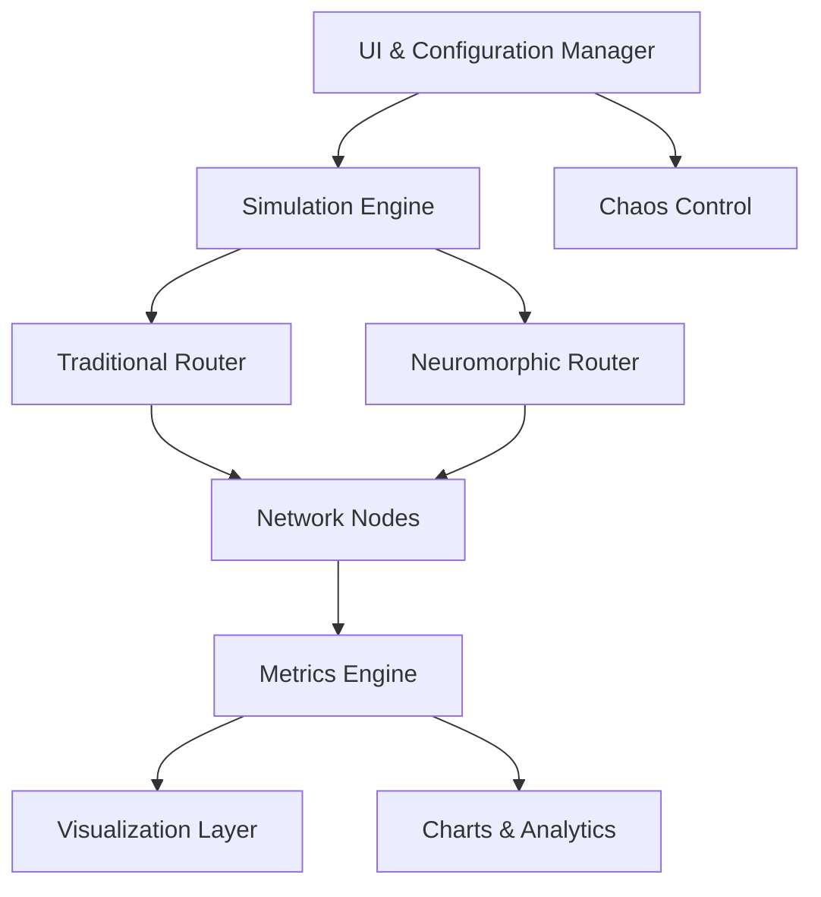
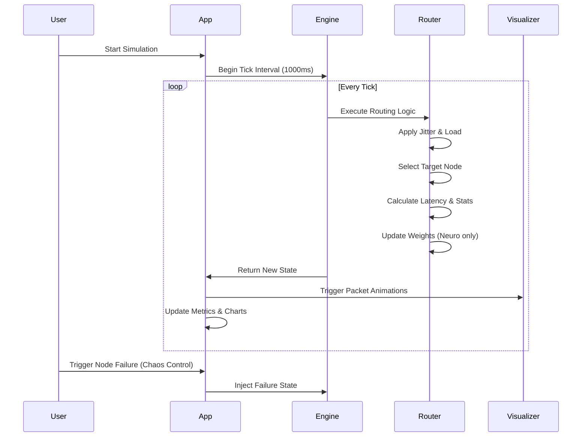

<div align="center">
  
</div>

# 🧠 Neuromorphic Routing Simulator

> An interactive web-based simulator visualizing and comparing Traditional Round-Robin routing with Adaptive Spike-Timing Dependent Plasticity (STDP) neuromorphic routing.

## 📌 Overview

The **Neuromorphic Routing Simulator** is an interactive, browser-based visualization tool designed to demonstrate the benefits of brain-inspired network routing algorithms compared to traditional static routing mechanisms. 

Developed to bridge the gap between theoretical neuroscience and distributed systems engineering, this project draws inspiration from biological neural networks where synaptic weights adjust based on the timing of spikes (Spike-Timing Dependent Plasticity). 

This simulator is ideal for software engineers, distributed systems architects, and AI researchers who want to understand how decentralized, event-driven, and adaptive routing can outperform static load balancers in environments with high volatility and node failures. It serves as an excellent educational and research sandbox for visualizing complex networking concepts in a minimalist, accessible interface.

## 🎯 Problem Statement

In modern distributed systems, traditional load balancing and routing algorithms face significant challenges:
- **Static Load Balancing:** Algorithms like Round-Robin blindly distribute traffic, often leading to bottlenecks when specific nodes experience unpredictable latency spikes.
- **Delayed Failure Detection:** Traditional systems route traffic to failed nodes until a health check officially marks them dead, severely impacting user experience and success rates.
- **Lack of Adaptability:** Centralized routing rules struggle to adapt in real-time to sudden network jitter and dynamic load changes, leading to inefficient resource utilization and congestion.

There is a critical need for intelligent, self-organizing routing mechanisms that can dynamically adapt to the network's state without relying on a slow, centralized authority.

## 💡 Proposed Solution

This simulator implements a **Neuromorphic Routing Architecture** that addresses these limitations using a decentralized, timing-based approach. 

By applying **Spike-Timing Dependent Plasticity (STDP)** and a **Winner-Takes-All** selection mechanism, the network continuously learns the optimal path based on real-time latency and success rates. Nodes that respond quickly have their selection probability (synaptic weight) increased, while slow or failed nodes are heavily penalized. This allows the system to instinctively avoid congested or offline nodes, resulting in higher throughput, lower latency, and remarkable fault tolerance compared to traditional static routing.

## ✨ Key Features

- **Interactive Routing Simulation:** Side-by-side visualization of Traditional (Round-Robin) vs. Neuromorphic (Adaptive STDP) routing.
- **Dynamic Network Behavior:** Simulates network jitter, dynamic load impact, and latency fluctuations.
- **Failure Simulation (Chaos Control):** Instantly kill or restore nodes to observe how the algorithms handle outages.
- **Real-Time Performance Analytics:** Live line charts and metrics comparing latency and throughput.
- **Node Status Monitoring:** Visual indicators for node state, load, latency, and neuromorphic weights.
- **Continuous Metrics Collection:** Real-time tracking of average latency, throughput, and success rates.

## 🏗 System Architecture

The application is built with a clear separation of concerns, operating entirely within the browser.

- **Simulation Engine (`services/simulationEngine.ts`):** The core logic governing the simulation tick, load generation, node state management, and the execution of both traditional and neuromorphic routing algorithms.
- **Visualization Layer (`components/SimulationVisualizer.tsx`):** A custom SVG-based animation engine that visually represents data packets traveling along paths, reflecting node states and routing decisions.
- **Metrics Engine (`components/MetricsCard.tsx`, `components/ChartSection.tsx`):** Collects and displays real-time statistical data (latency, throughput, success rate) and renders Recharts-based history graphs.
- **UI & Configuration Manager (`App.tsx`):** Orchestrates the layout, controls the simulation timer, manages chaos control (node failures), and coordinates state across all components.



## 🔄 Project Workflow



## 🧠 Routing Algorithms Explained

### 1. Traditional Routing (Round-Robin)
A static approach where requests are distributed sequentially across all available nodes. 
- **Mechanism:** Maintains an index and increments it for each request (`index = (index + 1) % nodes.length`).
- **Limitation:** It blindly sends traffic to the next node in the sequence, regardless of its current load, latency, or failure state.

### 2. Neuromorphic Routing (Adaptive STDP)
An intelligent, biology-inspired approach where nodes "compete" for traffic.
- **Winner-Takes-All Selection:** Selection probability is heavily weighted exponentially (`Math.exp(weight * 12)`). This ensures faster nodes are overwhelmingly preferred.
- **Spike-Timing Dependent Plasticity (STDP):** The algorithm compares the actual node latency against a target latency. 
- **Weight Updates:** 
  - If a node is selected and responds quickly, its weight increases (`weight += delta * learning_rate`).
  - If a node fails, it receives a massive penalty (`delta = -1000`), immediately dropping its selection probability to near zero.
  - Unselected nodes slowly decay in weight.

## 📊 Performance Metrics

The simulator continually tracks the following metrics to evaluate routing efficiency:
- **Average Latency (ms):** The exponentially weighted moving average of response times.
- **Throughput (req/sec):** The volume of requests processed, inversely proportional to latency and heavily penalized by failures.
- **Success Rate (%):** The percentage of successful requests. Hitting a failed node results in a 0% success for that tick, severely dragging down the average.

## 💻 Tech Stack

- **Frontend Framework:** React 19
- **Build Tool:** Vite
- **Language:** TypeScript
- **Visualization (Charts):** Recharts
- **Icons:** Lucide-React
- **Styling:** Tailwind CSS
- **Animation:** SVG `animateMotion` and CSS Transitions

## 📂 Folder Structure

```text
Neuromorphic-Routing-Simulator/
├── components/
│   ├── ChartSection.tsx         # Line charts for latency/throughput history
│   ├── MetricsCard.tsx          # Statistical display cards
│   └── SimulationVisualizer.tsx # SVG animation for packet routing
├── services/
│   └── simulationEngine.ts      # Core logic, STDP algorithm, stats calculation
├── App.tsx                      # Main application container and UI layout
├── constants.ts                 # Simulation parameters and visual themes
├── types.ts                     # TypeScript interfaces for state and nodes
├── index.tsx                    # React DOM entry point
├── index.html                   # HTML template
├── package.json                 # Project dependencies and scripts
├── tsconfig.json                # TypeScript configuration
└── vite.config.ts               # Vite bundler configuration
```

## 🚀 Installation

1. Clone the repository:
   ```bash
   git clone https://github.com/PranavSriram39/Neural-Route-Simulator.git
   cd Neuromorphic-Routing-Simulator
   ```
2. Install dependencies:
   ```bash
   npm install
   ```

## 📋 Prerequisites

- **Node.js**: v18.0.0 or higher
- **npm**: v8.0.0 or higher

## 🔐 Environment Variables

This project runs entirely in the browser and does not require any environment variables to function.

## 🏃 Running Locally

To start the development server, run:
```bash
npm run dev
```
Navigate to `http://localhost:5173` in your browser to interact with the simulator.

## 📸 Screenshots

| Home & Simulation Dashboard | Network Chaos & Metrics |
|:---:|:---:|
|  |  |

## 🔬 Methodology

The simulation operates on a fixed tick interval (1000ms). During each tick:
1. **State Injection:** Any manual overrides from the Chaos Control panel are injected.
2. **Algorithm Execution:** Both Round-Robin and STDP algorithms execute independently on their respective node sets.
3. **Simulation:** Jitter and load factors are calculated to simulate real-world network turbulence.
4. **Scoring:** Latency, throughput, and success rates are computed based on the chosen path's health.
5. **Learning:** The STDP router adjusts node weights based on the calculated latency delta.
6. **Visualization:** The new state triggers SVG `animateMotion` paths to visualize the packet trajectory.

## 🚧 Challenges

- **Synchronizing State with SVG Animations:** Ensuring the React state seamlessly triggers complex SVG `<mpath>` animations without visual stuttering.
- **Balancing the STDP Learning Rate:** Tuning the weight exponent (`Math.exp(weight * 12)`) and learning rate (`eta = 0.1`) to ensure the algorithm adapts aggressively to failures without becoming overly volatile during normal operation.

## 🚀 Future Improvements

- [ ] Implement additional routing algorithms (e.g., Least Connections, Weighted Round Robin).
- [ ] Add dynamic node provisioning (auto-scaling) visualization.
- [ ] Incorporate custom user-defined network topologies.
- [ ] Export simulation telemetry data to CSV/JSON.

## 🏆 Results

The simulator consistently demonstrates that under simulated node failures:
- **Traditional Routing:** Blindly drops success rates proportional to the number of failed nodes (e.g., 25% failure rate if 1 of 4 nodes dies).
- **Neuromorphic Routing:** Success rate recovers to >95% almost instantaneously as the STDP algorithm penalizes the failed node and routes traffic to healthy alternatives. It also yields significantly higher throughput and lower average latency.

## 🌍 Deployment Guide

This Vite-based React app can be easily deployed to static hosting providers like Vercel, Netlify, or GitHub Pages.

1. Build the production bundle:
   ```bash
   npm run build
   ```
2. The compiled assets will be in the `dist/` directory. Deploy this directory to your preferred hosting provider.

## 📚 Learning Outcomes

By interacting with and studying this simulator, developers will learn:
- The limitations of static routing mechanisms in distributed systems.
- How to implement decentralized, biologically-inspired algorithms (STDP) for load balancing.
- Techniques for visualizing complex data flow and state changes using React and SVG animation.
- The architectural separation of simulation engines from UI components.

## 🗺️ Roadmap

- [x] Initial Simulation Engine (Traditional vs Neuromorphic)
- [x] SVG-based Live Network Visualization
- [x] Real-time Metrics & Recharts Integration
- [x] Chaos Control (Failure Simulation)
- [ ] Custom Topology Builder
- [ ] Multi-region Latency Simulation

## 🤝 Contributing

Contributions are welcome! Please feel free to submit a Pull Request.
1. Fork the project.
2. Create your feature branch (`git checkout -b feature/AmazingFeature`).
3. Commit your changes (`git commit -m 'Add some AmazingFeature'`).
4. Push to the branch (`git push origin feature/AmazingFeature`).
5. Open a Pull Request.

## 📄 License

Distributed under the MIT License. See `LICENSE` for more information.

## ✍️ Author

**Pranav Sriram**
- GitHub: [@PranavSriram39](https://github.com/PranavSriram39)
